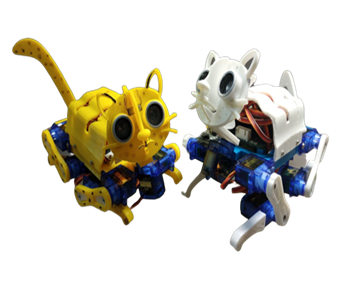
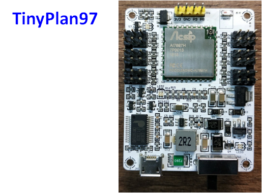
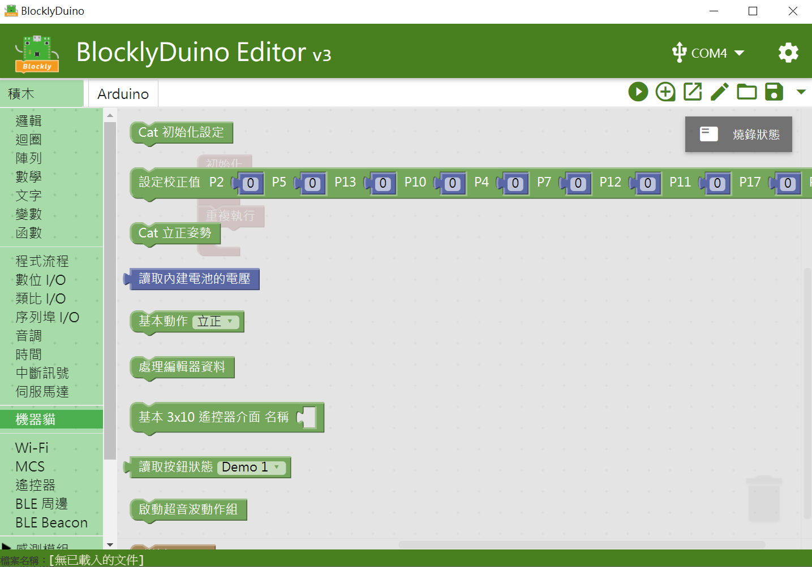
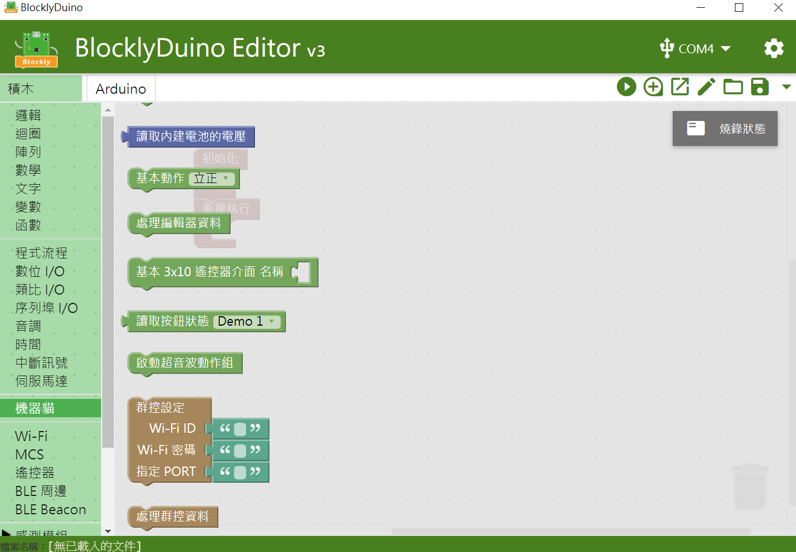
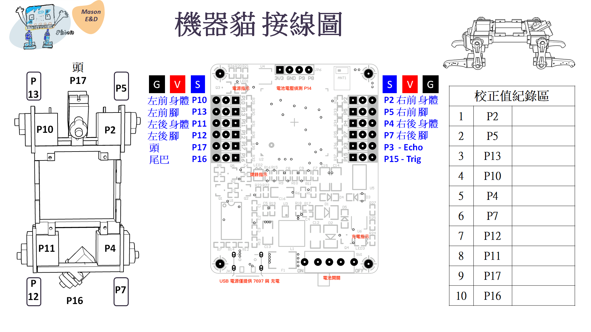
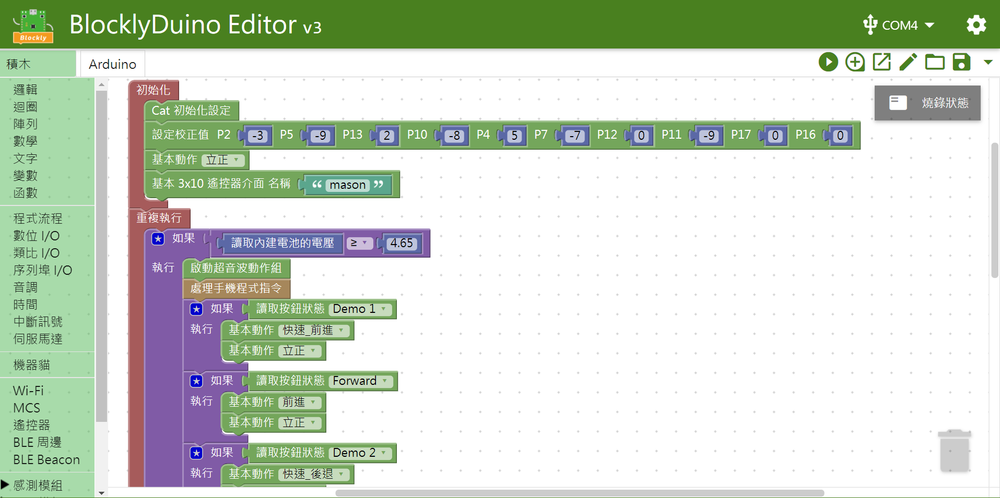
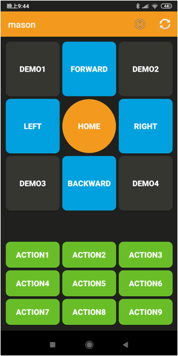
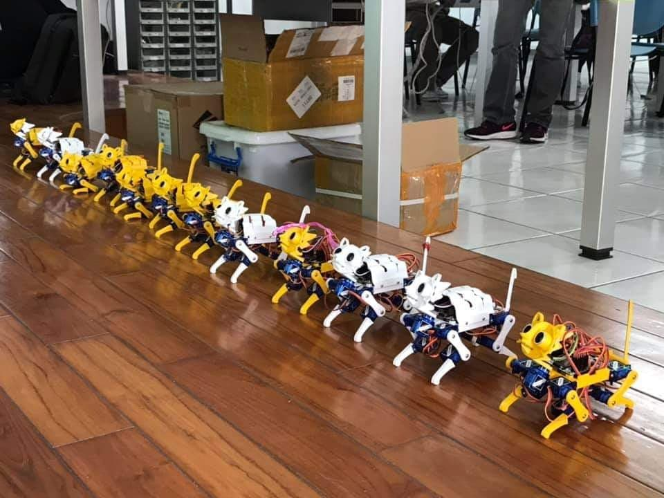

   
## Q-ter Cat V1 
Using TinyPlan97 to control the Robot Cat

This Blocklyduino extension will provide the basic motion for user to control the robot cat.

## How to use 
This extension is based on MediaTek-Labs/BlocklyDuino-for-LinkIt 

Source: 
https://github.com/MediaTek-Labs/BlocklyDuino-for-LinkIt/releases

1. Please download "blocklyduino-3.0.312b-win64-ide.zip" and decompress file. 
2. Update all files to these folders.  ("arduino-1.8.5" "package.nw" "sketches")
3. Open "BlocklyDuino.exe" file. 

Basic motion :

Forward / Backward / Turn Left / Turn Right / Sit / Say Hi

## Wiring Order Diagram

## Example code 

## Ready to go

## License

Non-Commercial license.

Author : Mason Chen
https://www.facebook.com/mason.chen.1420

