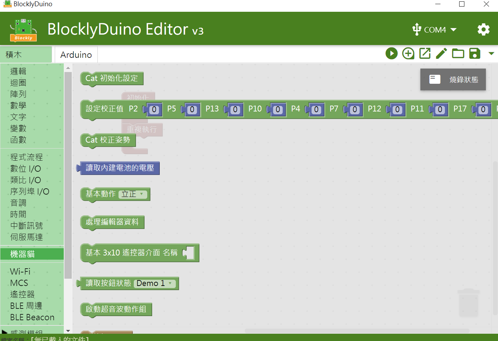

   
## Q-ter Cat V1 (Robot cat)
Using TinyPlan97 to control the Robot Cat

This Blocklyduino extension will provide the basic motion for user to control the robot cat.

Basic motion :

Forward / Backward / Turn Left / Turn Right / Sit / Say Hi

## Pin out 

Example code 

## License

Non-Commercial license.

Author : Mason Chen
https://www.facebook.com/mason.chen.1420

Supported targets
for PXT/microbit (The metadata above is needed for package search.)
c 2020 GitHub, Inc.
